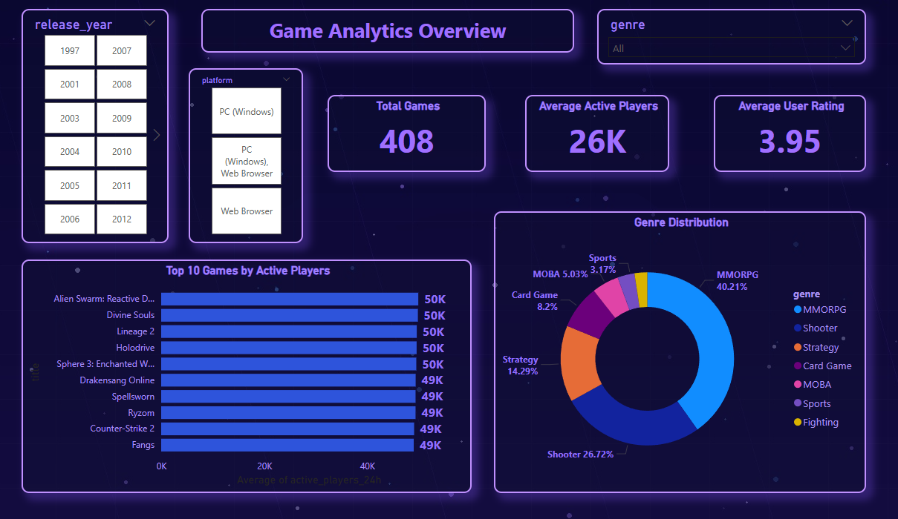
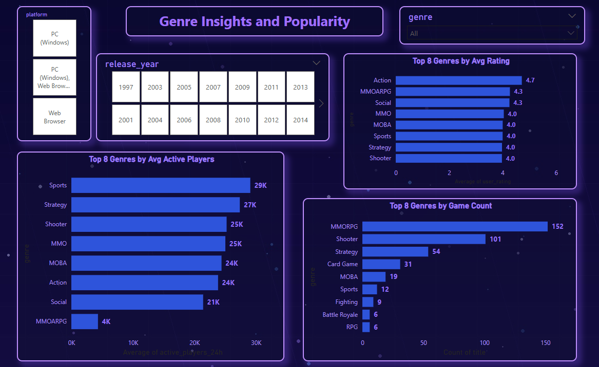
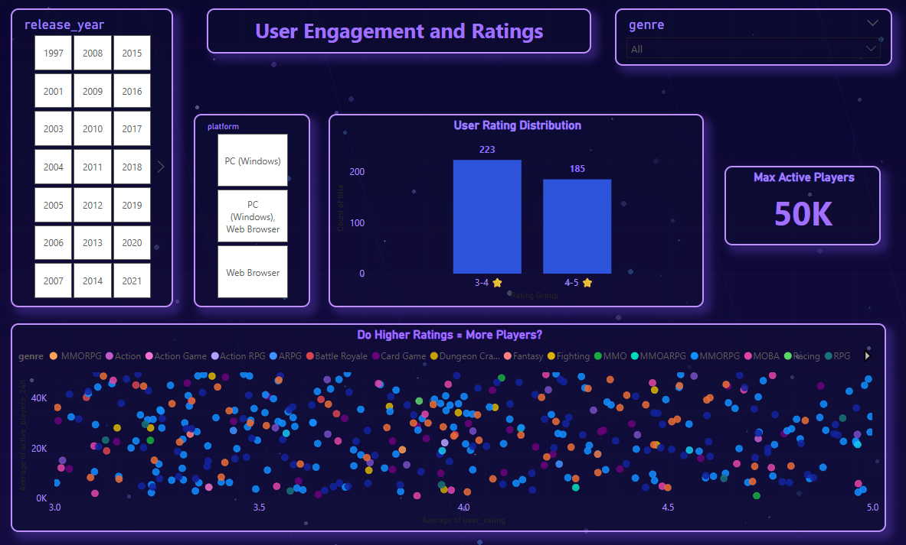
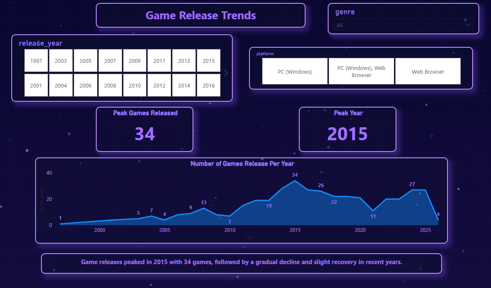

# 🎮 Game Analytics Project (EDA + Power BI Dashboard)

## 📌 Overview
This project focuses on analyzing free-to-play online games data to uncover insights about game popularity, genre trends, user engagement, and release patterns.

The analysis is performed using **Python (EDA)** and visualized through an interactive **Power BI Dashboard**.

---

## 🎯 Objectives
- Identify the most popular games based on active players
- Analyze distribution of games across genres
- Study user rating patterns and trends
- Explore relationship between ratings and player engagement
- Understand game release trends over time

---

## 🛠️ Tech Stack
- **Python** (Pandas, Matplotlib)
- **Jupyter Notebook**
- **Power BI**

---

## 📊 Key Insights

- 🎯 **MMORPG and Shooter** are the most dominant genres
- 📈 Game releases **peaked in 2015 with 34 games**
- ⭐ Most user ratings fall between **3.5 – 4.5**
- 🎮 No strong correlation between **higher ratings and more players**
- 🔥 **Sports and Strategy games** show high average player engagement

---

## 📂 Project Structure

```
Game-Analytics-Project-EDA-PowerBI/
│
├── data/
│   └── games_data.csv
│
├── images/
│   ├── overview_dashboard.png
│   ├── genre_analysis.png
│   ├── user_behaviour.png
│   ├── time_trends.png
│
├── notebook/
│   └── game_analytics.ipynb
│
├── dashboard/
│   └── game_dashboard.pbix
│
└── README.md
```


---

## 📸 Dashboard Preview

### 🔹 Overview Dashboard


---

### 🔹 Genre Analysis


---

### 🔹 User Behaviour


---

### 🔹 Time Trends


---

## 📈 Analysis Highlights

### 🔹 Top Games by Active Players
- Identified top 10 most popular games
- Compared engagement levels across genres

### 🔹 Genre Distribution
- Majority of games belong to MMORPG and Shooter categories
- Long-tail distribution across niche genres

### 🔹 User Rating Analysis
- Ratings are normally distributed around ~4.0
- Slight negative skew indicates most games are well-rated

### 🔹 Release Trends
- Rapid growth from 2010 to 2015
- Decline followed by stabilization in recent years

---

## 🚀 Conclusion
This project demonstrates how data analysis and visualization can provide valuable insights into gaming trends, helping understand user behavior and market dynamics.

---

## 👨‍💻 Author
**Piyush Langi**
